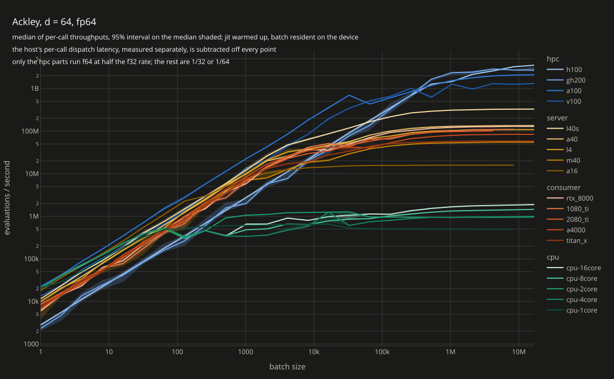
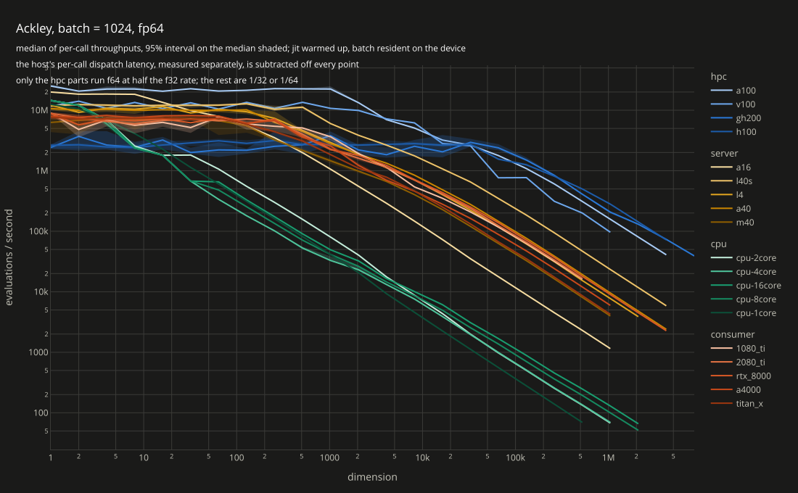

# Function benchmarks

How throughput of the JAX port scales, across the GPUs and CPUs of one cluster. Two axes, the same
climb with the axes swapped:

- **batch sweep** — grow the batch at a fixed dimension:
  [fp16](scaling-batch-fp16.html), [fp32](scaling-batch-fp32.html), [fp64](scaling-batch-fp64.html)
- **dim sweep** — grow the dimension at a fixed batch:
  [fp16](scaling-dim-fp16.html), [fp32](scaling-dim-fp32.html), [fp64](scaling-dim-fp64.html)

[](https://raw.githack.com/davidesartor/vlse/main/bench/functions/scaling-batch-fp64.html)

[](https://raw.githack.com/davidesartor/vlse/main/bench/functions/scaling-dim-fp64.html)

## Running it

No CUDA dependency: the bench runs on `jax.devices()[--device]`, so a CPU-only install, a CUDA
install and Apple silicon all work, and the device label is read off the backend at runtime.

```bash
uv run python -m bench functions run --sweep batch --dtype f32
uv run python -m bench functions run --sweep dim --dtype f32
uv run --group bench python -m bench functions plot
uv run python -m bench functions submit --dry-run
uv run python -m bench functions submit --repeats 5 --cores 8,16 --cpu-node cpu042
```

`plot`'s `--dim` and `--batch` only label the panels — they must match what the sweeps were run
with. plotly and kaleido — which draws the stills — are the `bench` dependency group rather than
project deps, and only that group's `uv run` needs them.

`submit` sends one job array per GPU chip the accessible partitions expose, plus one per core count
in `--cores`. Each array task is one point — one dtype, sweep and power-of-two size, passed as a
`dtype:sweep:exponent` script argument the task id picks from — and runs `--repeats` sequential
repeats of it, one row each; the default 12 is the smallest sample the plots' 95% interval can drop
two runs at each end for. The axis runs 2**0 through 2**24 regardless of device: most exponents OOM
or TIMEOUT long before the top, which costs that one array task and nothing else. `REPEATS`, `REPS`,
`DIM`, `BATCH` and `MAX_SECONDS` override the job scripts' defaults:

```bash
sbatch -a 1-2 -p cpu -w cpu042 --exclusive -c 1 -t 00:05:00 \
  -J functions-cpu1 -o bench/functions/logs/cpu1-%a.out bench/functions/slurm/cpu.sh f32:dim:10 f64:dim:10
```

Every CPU job lands on one node — `--cpu-node`, defaulting to an idle node carrying
`--cpu-feature` — and takes it exclusively, so the widths differ by width and nothing else. They
queue behind each other rather than running side by side, which is the cost of the curve meaning
anything. The job owning the whole node means the allocation no longer bounds the width, so the
script `taskset`s to cpus `0..cores-1`: XLA sizes its thread pool from the affinity mask.

## What is measured

One run is one point and `--repeats` rows: one size, timed back to back for every repeat — each the
median of `--reps` timed blocks, on its own random batch. The axis is climbed by the job array, one
task per size, rather than inside the process, so there is no cache to clear between points. The
spread comes from those sequential repeats, which share the point's compile but not its data.

The batch is generated on the device, drawn uniformly from the function's native `domain`; past
`2**28` it does not fit in host memory either. A batch sweep compiles once, since only the batch
axis moves; a dim sweep compiles per point, since `d` is a static field. Neither compile is timed.

Timing is blocked: one measurement covers `calls` back-to-back blocking calls and reports their
average, with `calls` chosen so a block lasts at least `--block-seconds` (0.05 s). At the small end
a single call is ~50 µs, which measures the host scheduler rather than the kernel.

Where a curve stops differs by device: each point is its own array task, so a size simply drops out
where its task OOMs or, on CPU (`--max-seconds 1`), runs past the clock rather than climbing toward
host memory for hours first. CPU curves therefore stop at a smaller size than the GPU ones, which is
where they were cut off, not where they plateaued.

## The result files

`results/<label>.csv` — one file per device, both sweeps and every dtype in it, one row per timing:

```
run,repeat,sweep,dtype,size,seconds
9843201,0,batch,f32,1,4.9e-05
```

A row carries the point it measured, so an array task appends its own and never widens another's.

`results/configs.csv` — the constants of each run, keyed by `label,sweep,dtype`, so they are not
repeated on every row. `d` is blank on a dim sweep and `batch` on a batch sweep: each names the
axis the other one fixed.

Colour carries the market segment the chip was sold into (`SEGMENTS` in
[`../style.py`](../style.py)) — CPU, consumer, server, HPC — one hue each, stepped within the
segment by peak throughput. Segment rather than raw speed because it is also roughly the memory
system: GeForce and Quadro are GDDR on a narrow bus, the server cards GDDR on a wide one, the HPC
parts HBM, and at these sizes the plateau is bandwidth.

## Caveats

- Per-batch throughput is what these functions are used for (sampling, surrogate fitting, population
  optimizers). Read the small end of either axis as latency: JAX is dispatch-bound there. What
  [`../dispatch/`](../dispatch/) measured is subtracted off every point, so the flat left end is the
  device and not the host — a point whose timings fall under that latency is dropped rather than
  reported, which is where a curve starts short of its neighbours.
- Only the `hpc` segment has f64 at half the f32 rate. Everything else runs it at 1/32 or 1/64 in
  hardware, two orders below its f32 line. Those curves are honest, and the gap is the point.
- Nodes are shared and clocks vary with what else is on the machine. Order-of-magnitude picture,
  not a certified ranking.
